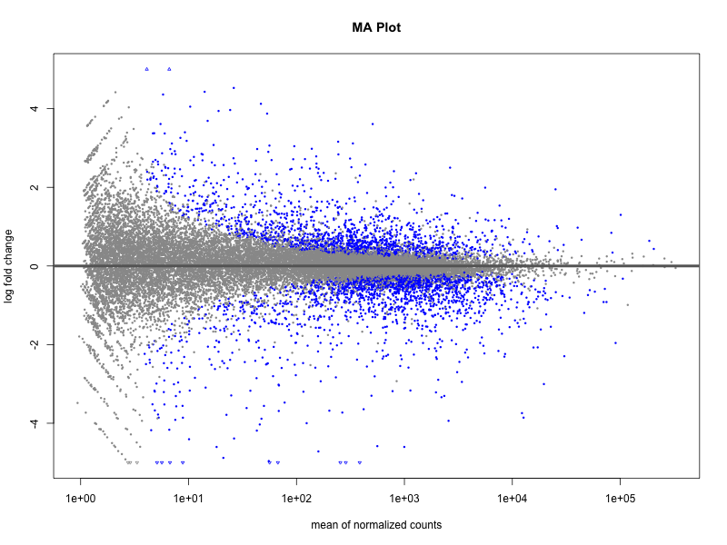
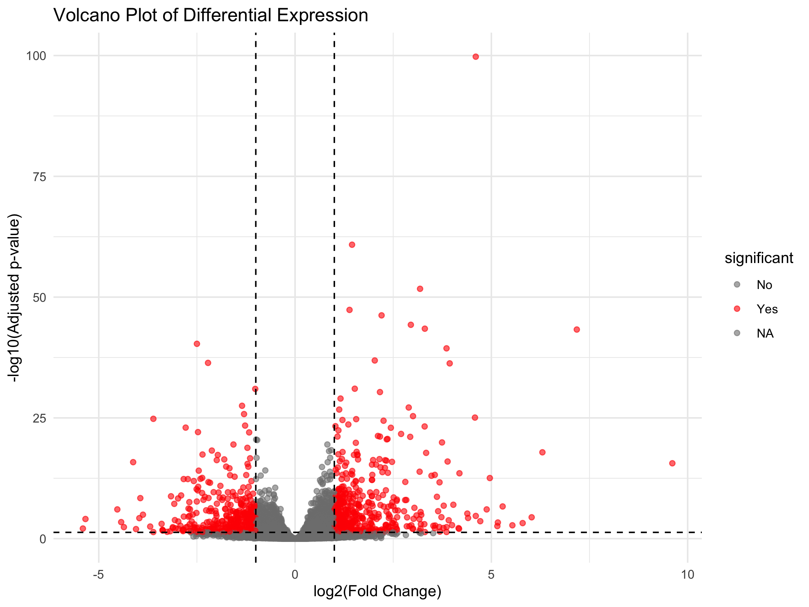
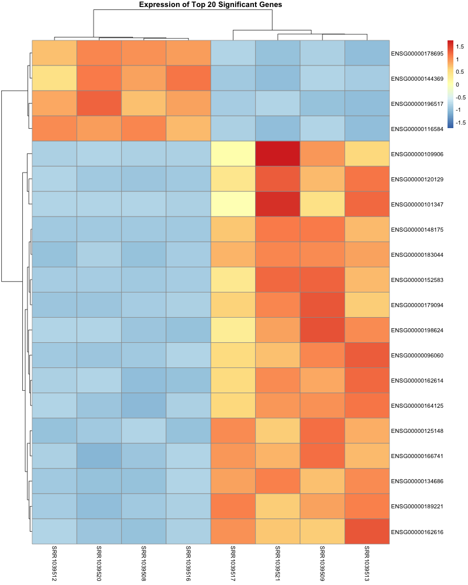

```{r setup, include=FALSE}
knitr::opts_chunk$set(echo = FALSE, warning=FALSE, message=FALSE)
library(tidyverse)
library(knitr)
library(DESeq2)

# Load the analysis results
de_results <- read_csv("output/tables/all_genes_results.csv")
sig_genes <- read_csv("output/tables/significant_genes.csv")
```

## Project Overview

This report presents a differential gene expression analysis using RNA-seq data from the `airway` experiment package. The analysis identifies genes that are significantly differentially expressed in airway smooth muscle cells treated with dexamethasone compared to untreated control cells.

## Introduction

Differential gene expression analysis is a fundamental bioinformatics approach to identify genes that change expression between experimental conditions. This analysis uses DESeq2, a widely-used R package for analyzing RNA-seq data, which employs statistical methods based on negative binomial distribution.

## Methods

### Data Source
The dataset was obtained from the Bioconductor `airway` package, which contains RNA-seq data from an experiment on airway smooth muscle cells treated with dexamethasone, a synthetic glucocorticoid steroid.

### Analysis Pipeline
1.  **Data Preparation**: Raw count data and sample metadata were extracted from the `airway` SummarizedExperiment object.
2.  **Quality Control**: Genes with fewer than 10 total counts across all samples were filtered out.
3.  **Differential Expression**: DESeq2 was used to identify significantly differentially expressed genes using a negative binomial generalized linear model.
4.  **Statistical Thresholds**: Genes were considered significant with an adjusted p-value (padj) < 0.05 and absolute log2 fold change > 1.
5.  **Visualization**: MA plots, volcano plots, and heatmaps were generated to visualize the results.

## Results

### Summary Statistics
```{r}
total_genes <- nrow(de_results)
sig_count <- nrow(sig_genes)
up_regulated <- sum(sig_genes$log2FoldChange > 1, na.rm = TRUE)
down_regulated <- sum(sig_genes$log2FoldChange < -1, na.rm = TRUE)
```

The analysis examined `r total_genes` genes after quality filtering. A total of **`r sig_count` genes** were identified as significantly differentially expressed using the threshold of adjusted p-value < 0.05 and |log2FC| > 1.

- **Up-regulated genes**: `r up_regulated` (log2FC > 1)
- **Down-regulated genes**: `r down_regulated` (log2FC < -1)

### MA Plot
The MA plot shows the relationship between gene expression (mean normalized counts) and fold change. Most points cluster around log2FC = 0, while significantly differentially expressed genes are shown in red.

```{r, fig.align='center', fig.cap="MA Plot showing log2 fold changes versus mean expression"}

```

### Volcano Plot
The volcano plot displays the statistical significance (-log10 adjusted p-value) against the magnitude of expression change (log2 fold change). Genes in the upper left and right quadrants represent the most biologically significant findings.

```{r, fig.align='center', fig.cap="Volcano plot of differential expression results"}

```

### Top Significant Genes
```{r}
top_10_genes <- sig_genes %>%
  arrange(padj) %>%
  head(10) %>%
  select(gene_id, log2FoldChange, padj, baseMean) %>%
  mutate(log2FoldChange = round(log2FoldChange, 2),
         padj = format.pval(padj, digits = 2),
         baseMean = round(baseMean, 0))

kable(top_10_genes, caption = "Top 10 Most Significant Differentially Expressed Genes")
```

### Expression Heatmap
The heatmap shows the expression patterns of the top significant genes across all samples, with genes clustered by expression similarity and samples clustered by expression profile.

```{r, fig.align='center', fig.cap="Heatmap of top significant genes across samples"}

```

## Discussion

The analysis successfully identified `r sig_count` genes that were significantly differentially expressed in response to dexamethasone treatment. The large number of affected genes suggests a substantial transcriptional response to glucocorticoid treatment, which is consistent with the known role of dexamethasone as a potent anti-inflammatory agent that regulates gene expression.

The top significant genes represent strong candidates for further biological validation and may include known glucocorticoid-responsive genes as well as potentially novel targets.

## Limitations

1.  This analysis used a relatively small sample size (4 treated vs 4 control).
2.  The analysis did not include additional covariates that might affect gene expression.
3.  Functional enrichment analysis (GO, KEGG) was not performed but would provide additional biological insights.

## Conclusion

This differential expression analysis identified a robust set of genes responsive to dexamethasone treatment in airway smooth muscle cells. The results provide a foundation for further investigation into the molecular mechanisms of glucocorticoid action and may contribute to understanding their therapeutic effects in respiratory diseases.

## References

1.  Love, M. I., Huber, W., & Anders, S. (2014). Moderated estimation of fold change and dispersion for RNA-seq data with DESeq2. Genome Biology, 15(12), 550.
2.  Himes, B. E., et al. (2014). RNA-Seq transcriptome profiling identifies CRISPLD2 as a glucocorticoid responsive gene that modulates cytokine function in airway smooth muscle cells. PLoS One, 9(6), e99625.

---

